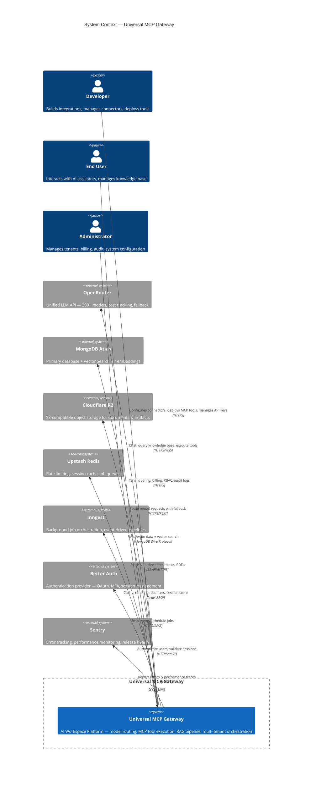
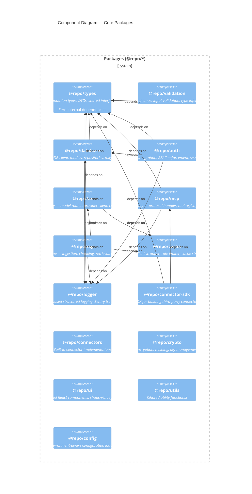
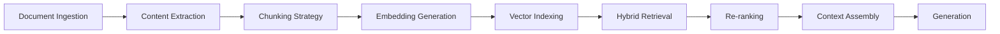
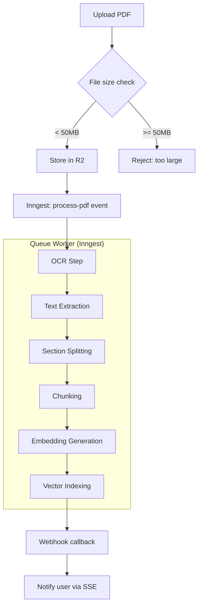
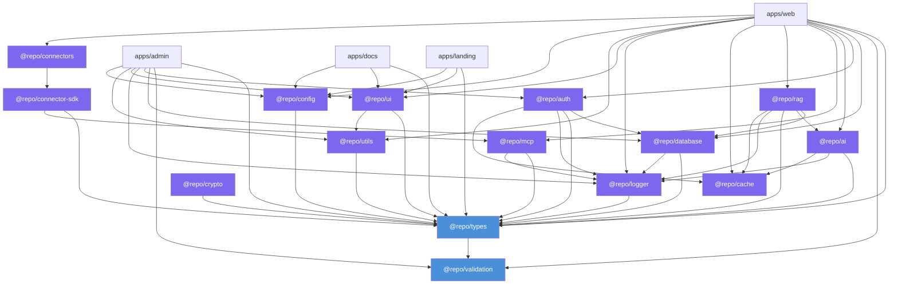
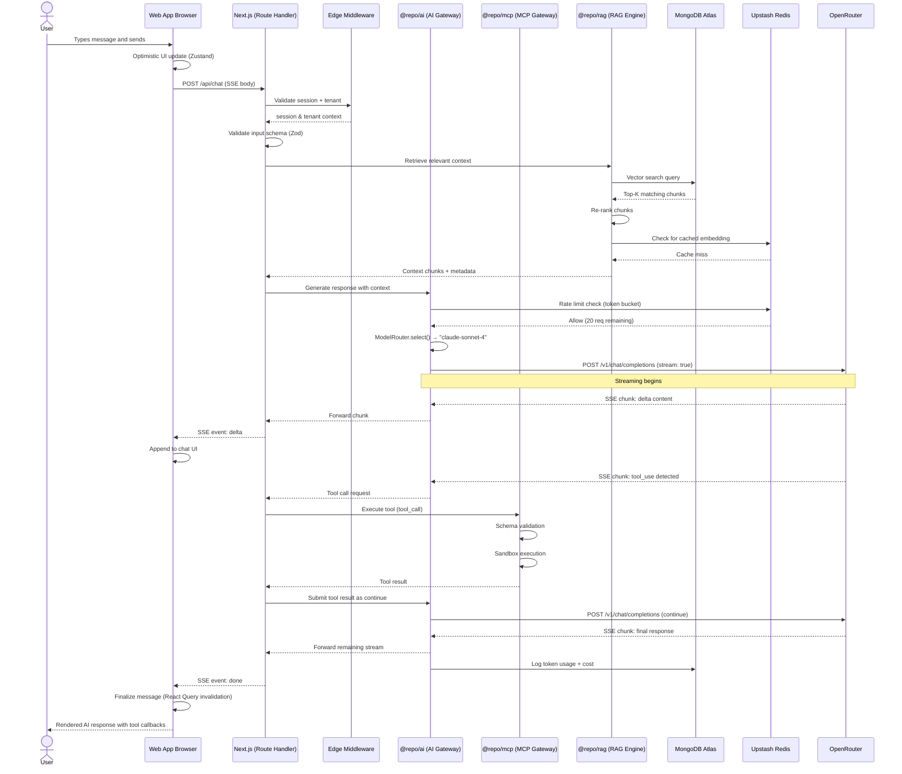

# Architecture: Universal MCP Gateway

> Enterprise AI Workspace Platform — Architecture Document  
> **Version:** 1.0.0 | **Stack:** Next.js 15, React 19, TypeScript, Turborepo

---

## Table of Contents

1. [C4 Model Overview](#1-c4-model-overview)
2. [Context Diagram (C4 Level 1)](#2-context-diagram-c4-level-1)
3. [Container Diagram (C4 Level 2)](#3-container-diagram-c4-level-2)
4. [Component Diagram (C4 Level 3)](#4-component-diagram-c4-level-3)
5. [AI Gateway Architecture](#5-ai-gateway-architecture)
6. [MCP Gateway Architecture](#6-mcp-gateway-architecture)
7. [RAG Pipeline Architecture](#7-rag-pipeline-architecture)
8. [PDF Processing Pipeline](#8-pdf-processing-pipeline)
9. [Authentication Architecture](#9-authentication-architecture)
10. [Multi-Tenant Architecture](#10-multi-tenant-architecture)
11. [Package Dependency Rules](#11-package-dependency-rules)
12. [Request Data Flow](#12-request-data-flow)
13. [Chat Message Sequence](#13-chat-message-sequence)
14. [Future Microservice Migration](#14-future-microservice-migration)

---

## 1. C4 Model Overview

This document uses the **C4 model** (Context, Container, Component, Code) to describe the system architecture at four levels of abstraction, following Simon Brown's methodology. Each level targets a different audience and provides increasing detail:

| Level | Name | Audience | Abstraction |
|-------|------|----------|-------------|
| 1 | Context | Technical & non-technical stakeholders | System boundaries, users, external systems |
| 2 | Container | Developers, DevOps, architects | High-level technology decisions |
| 3 | Component | Developers | Internal package structure |
| 4 | Code | Developers | Implementation details (not covered here) |

---

## 2. Context Diagram (C4 Level 1)

The system acts as a unified AI workspace platform. Three user personas interact with four external services.



---

## 3. Container Diagram (C4 Level 2)

The system comprises four Next.js applications, five service containers, and three infrastructure containers, all within a single Turborepo monorepo.

```mermaid
C4Container
  title Container Diagram — Universal MCP Gateway

  Person(endUser, "End User", "Interacts with AI assistants")

  System_Boundary(monorepo, "Monorepo — Turborepo") {

    Boundary(apps, "Applications (Next.js 15 App Router)") {
      Container(webApp, "Web App", "Next.js 15, React 19, TailwindCSS", "Main user-facing chat & workspace interface")
      Container(adminApp, "Admin App", "Next.js 15, React 19, shadcn/ui", "Tenant management, billing, audit")
      Container(docsApp, "Docs App", "Next.js 15, MDX", "Developer documentation & API reference")
      Container(landingApp, "Landing App", "Next.js 15, TailwindCSS", "Marketing site, pricing, sign-up flow")
    }

    Boundary(services, "Service Layer") {
      Container(apiLayer, "API Layer", "Next.js Route Handlers, tRPC", "REST endpoints, real-time WebSockets, tRPC procedures")
      Container(aiGateway, "AI Gateway", "Node.js, OpenRouter SDK", "Model routing, provider abstraction, fallback, streaming")
      Container(mcpGateway, "MCP Gateway", "Node.js, JSON-RPC 2.0", "MCP protocol handler, tool registry, sandbox execution")
      Container(ragEngine, "RAG Engine", "Node.js, LangChain-like pipeline", "Ingestion, chunking, embedding, retrieval, re-ranking")
      Container(queueWorkers, "Queue Workers", "Node.js, Inngest", "Async processing: PDF, indexing, notifications")
    }

    Boundary(data, "Data Layer") {
      ContainerDb(database, "MongoDB Atlas", "MongoDB 7.x", "Primary document store + Vector Search indexes")
      ContainerDb(cache, "Upstash Redis", "Redis 7.x", "Session cache, rate limiting, hot data")
      ContainerDb(storage, "Cloudflare R2", "S3-compatible", "Document storage, PDF archives, model artifacts")
    }
  }

  Rel(endUser, webApp, "HTTPS/WSS")
  Rel(webApp, apiLayer, "Server Actions & Route Handlers")
  Rel(apiLayer, aiGateway, "Internal module call")
  Rel(apiLayer, mcpGateway, "Internal module call")
  Rel(apiLayer, ragEngine, "Internal module call")
  Rel(aiGateway, mcpGateway, "Tool execution requests")
  Rel(ragEngine, aiGateway, "Embedding & generation requests")

  Rel(aiGateway, database, "Store cost & usage records", "MongoDB Wire Protocol")
  Rel(aiGateway, cache, "Rate limit counters", "Redis RESP")
  Rel(mcpGateway, database, "Tool definitions & execution logs", "MongoDB Wire Protocol")
  Rel(ragEngine, database, "Document metadata, chunks, vectors", "MongoDB Wire Protocol")
  Rel(ragEngine, cache, "Cached embeddings", "Redis RESP")
  Rel(ragEngine, storage, "Document content", "S3 API/HTTPS")

  Rel(queueWorkers, inngest, "Register & consume events")
  Rel(queueWorkers, storage, "Read/write large payloads")
  Rel(queueWorkers, database, "Update processing state")
```

---

## 4. Component Diagram (C4 Level 3)

The system is decomposed into 15 packages within a Turborepo workspace. The diagram below shows the core packages and their dependencies.



---

## 5. AI Gateway Architecture

The AI Gateway (`@repo/ai`) is the central routing and orchestration layer for all large language model interactions. It decouples the application from specific model providers and enables intelligent routing, failover, and cost management.

### Core Components

| Component | Responsibility |
|-----------|---------------|
| `ModelRouter` | Selects the optimal model based on task, cost, availability, and user tier |
| `ProviderAdapter` | Abstract interface for LLM providers — each provider implements this adapter |
| `OpenRouterClient` | Primary provider adapter — proxies through OpenRouter for 300+ models |
| `FallbackChain` | Sequential fallback across models/providers on failure |
| `StreamManager` | Handles SSE streaming, backpressure, cancellation, and chunk aggregation |
| `RateLimiter` | Token-bucket algorithm per user/tenant/IP using Upstash Redis |
| `CostTracker` | Records per-call token usage, cost, and latency to MongoDB |
| `PromptPipeline` | System prompt assembly, context window management, token budgeting |

### Model Routing Strategy

```text
Request arrives with task type: chat | completion | embedding | tool_call

1. ModelRouter evaluates:
   - User tier (free / pro / enterprise)
   - Task requirements (context window, capability)
   - Cost budget allocation
   - Current provider health (circuit breaker state)
   
2. Primary model selected (e.g., gpt-4o for complex, claude-haiku for simple)

3. ProviderAdapter translates to provider-specific API format

4. On failure (rate limit, timeout, 5xx):
   - FallbackChain activates
   - Attempts next model in priority list
   - Circuit breaker opens after N consecutive failures
   
5. StreamManager pipes response chunks through SSE

6. CostTracker logs final token counts asynchronously
```

### Rate Limiting

Applied at three tiers simultaneously using Redis sorted sets and sliding windows:

```text
Global:         1000 req/s — enforced at gateway ingress
Per-Tenant:     100 req/s  — configured per tenant plan
Per-User:        20 req/s  — applied per authenticated session
Per-Token:        5 req/s  — burst limit for streaming
```

---

## 6. MCP Gateway Architecture

The MCP Gateway (`@repo/mcp`) implements the **Model Context Protocol** (JSON-RPC 2.0 based) to allow AI models to discover and execute tools dynamically.

### Protocol Layer

The gateway speaks MCP over two transports:

| Transport | Use Case |
|-----------|----------|
| **HTTP SSE** | Browser-based AI assistants (primary) |
| **WebSocket** | Persistent connections requiring bidirectional streaming |

### Core Components

```text
┌─────────────────────────────────────────┐
│           HTTP / WebSocket              │
├─────────────────────────────────────────┤
│         Protocol Handler                │
│  (JSON-RPC 2.0 message parsing)         │
├─────────────────────────────────────────┤
│         Tool Registry                   │
│  Discover / Register / Deprecate tools  │
├──────────────────┬──────────────────────┤
│  Connector       │  Built-in            │
│  Bridge          │  Tool Executor       │
│  (3rd-party)     │  (1st-party)         │
├──────────────────┴──────────────────────┤
│         Execution Sandbox               │
│  (VM isolation, timeout, resource limit)│
├─────────────────────────────────────────┤
│         Audit Logger                    │
│  (Every tool call recorded to MongoDB)  │
└─────────────────────────────────────────┘
```

### Tool Lifecycle

1. **Registration** — Tools are registered via `ToolRegistry` with name, schema (JSON Schema), and handler function. First-party tools live in `@repo/mcp/tools`. Third-party tools arrive via `@repo/connector-sdk`.

2. **Discovery** — The `tools/list` endpoint returns all available tools for the current tenant/user context, respecting RBAC permissions.

3. **Execution** — The `tools/call` endpoint receives parameters, validates against the registered schema, executes the handler, and returns the result. All calls are sandboxed.

4. **Streaming** — Tools supporting progressive results emit `tool/call:progress` notifications via SSE or WebSocket.

### Execution Sandbox

Every tool handler runs in an isolated execution context:

```text
- Timeout:    30s default, configurable per tool
- Memory:     128 MB limit
- Network:    Restricted to allowlisted endpoints
- Filesystem: Read-only except temp directory
- Context:    Injected tenant ID, user ID, trace ID
```

### Connector Bridge

Third-party tools are loaded via `@repo/connector-sdk` as dynamically linked modules. Each connector declares:

- **Metadata**: name, version, author, description
- **Auth**: OAuth2 / API key / none
- **Tools**: array of tool definitions with JSON Schema
- **Lifecycle**: `onActivate`, `onDeactivate`, `onError`

Connectors are isolated similarly to first-party tools but additionally loaded in separate Node.js `worker_threads` for fault isolation.

---

## 7. RAG Pipeline Architecture

The RAG Engine (`@repo/rag`) implements a complete retrieval-augmented generation pipeline with production-grade chunking, embedding, and re-ranking.

### Pipeline Stages



### Stage Details

**Ingestion** — Documents arrive via API upload, webhook, or connector sync. Metadata (tenant, tags, source, content-type) is extracted and stored in MongoDB. Raw content is stored in Cloudflare R2.

**Chunking** — Multiple strategies are available, configurable per document type:

| Strategy | Description | Best For |
|----------|-------------|----------|
| `recursive` | Recursive character splitting with overlap | General text |
| `semantic` | Splits at topic boundaries using embedding similarity | Long-form docs |
| `code` | Language-aware code chunking | Source files |
| `pdf` | Section-aware splitting using PDF structure | PDF documents |

Default configuration: 1024 tokens per chunk with 128 token overlap using recursive splitting.

**Embedding** — Embeddings are generated via OpenRouter's embedding models (e.g., `text-embedding-3-large`). Results are cached in Redis with a configurable TTL to avoid redundant API calls for identical chunks.

**Vector Indexing** — Embeddings are stored in MongoDB Atlas Vector Search indexes:

```javascript
// Index definition
{
  "name": "chunk_vector_index",
  "type": "vectorSearch",
  "fields": [{
    "path": "embedding",
    "numDimensions": 3072, // text-embedding-3-large
    "similarity": "cosine"
  }]
}
```

**Hybrid Retrieval** — Combines vector similarity search with keyword (text index) search using a weighted scoring algorithm:

```text
final_score = (0.7 * vector_score) + (0.3 * keyword_score)
```

Retrieval supports filtering by tenant, document ID, and metadata fields as pre-filtering before the vector search (`MUST` / `SHOULD` semantics).

**Re-ranking** — A cross-encoder re-ranker (via OpenRouter or local Cohere rerank) scores the top K results (default K=20) and returns the top N (default N=5) to ensure maximum relevance.

**Context Assembly** — Retrieved chunks are assembled into a prompt context window, respecting the model's context limit. A token budget is allocated: 70% for retrieved context, 30% for instructions and conversation history.

**Generation** — The assembled context is passed to the AI Gateway for LLM generation using the configured model.

---

## 8. PDF Processing Pipeline

PDF processing is a specialized pipeline orchestrated through Inngest background jobs.



### Processing Steps

| Step | Tool | Description |
|------|------|-------------|
| **OCR** | Tesseract.js or OpenAI Vision | Extracts text from scanned images embedded in PDF |
| **Text Extraction** | pdf-parse / pdf.js | Extracts native text layer with positional metadata |
| **Section Splitting** | Heuristic parser | Identifies sections by font size, headings, page breaks |
| **Chunking** | `@repo/rag` chunker | Applies PDF-aware semantic chunking |
| **Embedding** | OpenRouter embedding API | Generates vector embeddings for each chunk |
| **Indexing** | MongoDB Atlas Vector Search | Upserts chunk embeddings with document metadata |

Each step emits an Inngest event for observability and potential retry:

```typescript
// Events in the pipeline
"pdf/uploaded"     → "pdf/ocr/started"   → "pdf/ocr/completed"
                    → "pdf/extract/started" → "pdf/extract/completed"
                    → "pdf/chunk/started"   → "pdf/chunk/completed"
                    → "pdf/embed/started"   → "pdf/embed/completed"
                    → "pdf/index/started"   → "pdf/index/completed"
```

If any step fails, the job retries up to 3 times with exponential backoff, then moves to a dead-letter queue for manual inspection.

---

## 9. Authentication Architecture

Authentication is handled by **Better Auth**, a framework-agnostic authentication library with first-class Next.js support.

### Integration Points

```text
┌─────────────────────────────────────────────────────┐
│                    Next.js App                       │
│  ┌─────────────┐  ┌──────────────┐  ┌────────────┐ │
│  │ Middleware   │  │ Server       │  │ Client     │ │
│  │ (edge)      │  │ Components   │  │ Components │ │
│  │             │  │              │  │ (Zustand)  │ │
│  │ Session     │  │ auth()       │  │ useSession │ │
│  │ validation  │  │ helper       │  │ hook       │ │
│  └─────────────┘  └──────────────┘  └────────────┘ │
│                      │                               │
└──────────────────────┼───────────────────────────────┘
                       │
              ┌────────▼────────┐
              │  @repo/auth     │
              │  ┌────────────┐ │
              │  │ Better Auth│ │
              │  │ Server     │ │
              │  │ Client     │ │
              │  └────────────┘ │
              │  ┌────────────┐ │
              │  │ RBAC       │ │
              │  │ Enforcer   │ │
              │  └────────────┘ │
              │  ┌────────────┐ │
              │  │ Session    │ │
              │  │ Store      │ │
              │  └────────────┘ │
              └─────────────────┘
```

### Authentication Flow

1. **Sign-up / Sign-in** — Better Auth handles OAuth providers (Google, GitHub, Microsoft), email/password, and magic links. User records are created in MongoDB via `@repo/database`.

2. **Session Management** — Sessions are stored in Upstash Redis (via `@repo/cache`) with a configurable TTL (default: 7 days). The session token is persisted in an HTTP-only, SameSite=Strict cookie.

3. **Middleware Validation** — Next.js Edge Middleware validates the session token on every request. If expired, the middleware attempts a silent refresh. If refresh fails, the user is redirected to sign-in.

4. **Server Component auth()** — A helper wrapping Better Auth's `getSession()` for use in React Server Components and Route Handlers.

5. **Client Side** — A Zustand store (`useSession`) syncs with the server via SWR/React Query using Better Auth's client hooks.

### Multi-Factor Authentication

MFA is supported via TOTP (time-based one-time passwords). The MFA enrollment and verification flow is orchestrated through `@repo/auth`:

- **Enrollment**: User registers a TOTP authenticator app — a QR code is generated and verified with an initial code.
- **Verification**: After primary authentication, if MFA is enabled, the user is prompted for a TOTP code.
- **Recovery**: Recovery codes are generated during enrollment and hashed using `@repo/crypto` before storage.

### RBAC Enforcement

Access control is enforced at three layers:

| Layer | Mechanism | Enforced At |
|-------|-----------|-------------|
| **Edge** | Middleware checks session + route permissions | Edge runtime |
| **Server** | `requireRole()` / `requirePermission()` helpers | Route Handler / Server Action |
| **Client** | `usePermissions()` hook (Zustand) | UI rendering |

Roles: `owner` | `admin` | `member` | `viewer`

Permissions are defined as a flat set of strings (e.g., `workspace:chat`, `workspace:admin`, `connector:install`) and checked against the user's role within a tenant.

---

## 10. Multi-Tenant Architecture

Every entity in the system is tenant-scoped. Isolation is enforced at the database, cache, storage, queue, and logging layers.

### Tenant Identification

Every request carries a tenant context established by:
1. **Subdomain**: `tenant.example.com`
2. **Path prefix**: `example.com/org/{tenantSlug}`
3. **JWT claim**: `tenant_id` embedded in the session token

### Isolation Strategy

| Layer | Isolation Mechanism | Implementation |
|-------|---------------------|---------------|
| **Database** | Collection-level `tenantId` field | Every MongoDB document has `tenantId`; all queries include a mandatory filter. Repository layer enforces this automatically. |
| **Indexes** | Partial vector search indexes | Each tenant's vectors stored with `tenantId` in the index, enabling pre-filtering |
| **Cache (Redis)** | Key prefix | `tenant:{tenantId}:{key}` — each tenant's keys are namespaced |
| **Object Storage (R2)** | Bucket prefix or subdirectory | `/{tenantId}/{objectKey}` — logical separation within a single bucket |
| **Queue (Inngest)** | Event prefix | `{tenantId}/event-name` — workers route based on tenant prefix |
| **Logging (Pino/Pino-Sentry)** | Enriched context | Every log line includes `tenantId` field; Sentry tags are set per-tenant |

### Tenant Onboarding Flow

```text
1. Admin creates tenant via Admin API
2. Tenant record written to MongoDB with configuration
3. Dedicated rate limits provisioned in Redis
4. Default roles created in auth database
5. Welcome webhook fires (async via Inngest)
6. Tenant is active — users can now sign in
```

### Data Isolation Guarantees

- **Read isolation**: Repository layer injects `tenantId` into every query. It is structurally impossible to read another tenant's data without explicitly bypassing the repository (which requires elevated permissions).
- **Write isolation**: The same filter applies to all write operations. Bulk operations are tenant-scoped.
- **Storage isolation**: R2 paths are prefixed; no shared file access across tenants.
- **Rate limit isolation**: Redis keys are scoped per tenant; one tenant cannot exhaust another's budget.

---

## 11. Package Dependency Rules

The monorepo enforces strict dependency direction with no circular dependencies and no package depending on any app.

### Dependency Graph



### Enforcement Rules

| Rule | Description |
|------|-------------|
| **Acyclic** | No circular dependencies are permitted. The graph is a DAG. |
| **No app → package** | Packages never import from apps. All dependency arrows point from apps to packages or between packages. |
| **Foundation first** | `@repo/types` has zero internal dependencies. It is the root of the dependency tree. |
| **Package boundary** | Packages only expose what is exported through their `index.ts` barrel file. Internal modules are private. |
| **`@repo/connectors` is special** | It depends on `@repo/connector-sdk` and is the only package that imports third-party connector implementations. |
| **No skipped layers** | An app cannot import `@repo/database` without also depending on `@repo/types` and `@repo/logger`. |
| **Build order** | Turborepo resolves build order from the dependency graph automatically. `@repo/types` is built first, apps are built last. |

---

## 12. Request Data Flow

Every request follows a layered architecture that enforces separation of concerns.

```text
┌──────────┐     ┌──────────────┐     ┌────────────┐     ┌──────────────┐
│  Client  │ ──> │  Next.js     │ ──> │  Service   │ ──> │  Repository  │
│ (Browser)│ <── │  Route       │ <── │  Layer     │ <── │  (Data)      │
└──────────┘     │  Handler     │     │  (@repo)   │     └──────┬───────┘
                 └──────────────┘     └────────────┘            │
                          │                                     │
                     ┌────▼────┐                     ┌──────────▼────────┐
                     │  Auth   │                     │  ┌──────┬──────┐  │
                     │  Middle │                     │  │ DB   │Cache │  │
                     │  (Edge) │                     │  │      │      │  │
                     └─────────┘                     │  │ R2   │Inngest│ │
                                                     │  └──────┴──────┘  │
                                                     └───────────────────┘
```

### Layer Responsibilities

| Layer | Location | Responsibility |
|-------|----------|---------------|
| **Edge Middleware** | `middleware.ts` | Session validation, tenant resolution, redirect, rate limit check |
| **Route Handler** | `app/api/**/route.ts` | HTTP parsing, validation (via `@repo/validation`), response formatting |
| **Service Layer** | `@repo/*/services/` | Business logic, orchestration, cross-cutting concerns |
| **Repository Layer** | `@repo/*/repositories/` | Data access, query building, tenant-scoped filters |

### Flow Example: Create Document

```text
1. POST /api/documents (multipart form)
2. Edge Middleware: validate session → resolve tenant → attach tenantId
3. Route Handler: parse form → validate with Zod → call service
4. DocumentService.create():
   a. Upload raw file to R2 → get object key
   b. Create document record in MongoDB (tenant-scoped)
   c. Emit "documents/created" event to Inngest
   d. Return document DTO
5. Route Handler: return 201 JSON response
```

---

## 13. Chat Message Sequence

The following sequence diagram illustrates the end-to-end flow of a user sending a chat message that triggers AI model inference and MCP tool execution.



### Key Observations

- **Streaming is first-class**: The entire pipeline supports streaming, from OpenRouter SSE through to the browser event source.
- **MCP tools are dynamic**: Tool calls are detected mid-stream, executed, and the result is fed back into the model conversation.
- **RAG is pre-fetched**: Context is retrieved before the AI call to minimize time-to-first-token.
- **Optimistic UI**: The client renders the user message immediately; the assistant response is streamed incrementally.

---

## 14. Future Microservice Migration

The monorepo architecture is designed from the ground up for eventual extraction into independent microservices. This is not an afterthought — it is a core architectural principle enforced by the package dependency graph.

### Extraction Readiness Principles

| Principle | Implementation |
|-----------|---------------|
| **Well-defined boundaries** | Each `@repo/` package has a single responsibility and exports a stable API surface. No package knows about the internal implementation of another. |
| **Repository pattern** | All data access goes through repository classes. Switching from in-process to HTTP-based data access requires changing only the repository implementation. |
| **Event-driven integration** | Cross-cutting concerns (notification, indexing, audit) are emitted as Inngest events. Services can be extracted and subscribe to the same events. |
| **API composition** | The Next.js API layer uses a thin orchestration pattern that can be replaced with a BFF (Backend-for-Frontend) gateway or API gateway (Kong, Envoy) without service changes. |

### Extraction Strategy

```text
Phase 1 — Monolith (current state)
┌──────────────────────────────────────────┐
│           Next.js Monolith               │
│  ┌───┐ ┌───┐ ┌───┐ ┌───┐ ┌───┐ ┌───┐  │
│  │AI │ │MCP│ │RAG│ │Auth│ │DB │ │...│  │
│  └───┘ └───┘ └───┘ └───┘ └───┘ └───┘  │
└──────────────────────────────────────────┘

Phase 2 — AI Gateway microservice
┌─────────────────────┐  ┌──────────────────┐
│  Next.js (orchestr.)│  │  @repo/ai -> svc │
│  Routes chat, calls │──│  Standalone HTTP  │
│  AI via HTTP        │  │  Fastify/Express  │
└─────────────────────┘  └──────────────────┘

Phase 3 — MCP Gateway microservice
┌──────────────┐  ┌──────────────┐  ┌──────────────┐
│  Next.js     │  │  AI Service  │  │  MCP Service │
│  Orchestrator│──│  (extracted) │──│  (extracted) │
└──────────────┘  └──────────────┘  └──────────────┘

Phase 4 — Full microservices
┌──────────────┐  ┌──────────────┐  ┌──────────────┐
│  API Gateway │  │  AI Service  │  │  MCP Service │
│  (Kong/Envoy)│──│  (extracted) │──│  (extracted) │
└──────┬───────┘  └──────────────┘  └──────────────┘
       │          ┌──────────────┐  ┌──────────────┐
       ├──────────│  RAG Service │  │  Auth Service │
       │          │  (extracted) │──│  (extracted) │
       │          └──────────────┘  └──────────────┘
       │          ┌──────────────┐  ┌──────────────┐
       └──────────│  Queue        │  │  Sync        │
                  │  Workers     │  │  (connectors)│
                  └──────────────┘  └──────────────┘
```

### What Enables Extraction

1. **Package isolation** — `@repo/ai`, `@repo/mcp`, `@repo/rag`, and `@repo/auth` are independently testable and contain no Next.js-specific code. They import only from other `@repo/` packages.

2. **Repository pattern** — A service that currently calls `DocumentRepository.findByTenant()` in-process can be extracted to call `POST /api/documents/search` or a gRPC endpoint by swapping the repository implementation. The interface stays the same.

3. **Event-driven hooks** — Side effects (logging, notifications, indexing) are emitted as Inngest events, not called synchronously. Extracted services subscribe to the same Inngest event bus.

4. **Shared types** — `@repo/types` becomes a published npm package consumed by all microservices, ensuring type consistency across service boundaries.

5. **No app coupling** — No package imports from any app. Apps are consumers. Extracting a package to a service requires zero changes to the package itself; only the apps need to update their import paths to point at HTTP clients.

### When to Extract

Extraction should occur when:

- **Traffic demands independent scaling**: The AI Gateway handles significantly more traffic than the MCP Gateway and needs independent horizontal scaling.
- **Deployment velocity requires it**: A change to `@repo/mcp` requires a full monolith deployment. Extracted services can deploy independently.
- **Team boundaries form**: Autonomous teams own individual services and require independent release cycles.
- **Operational isolation**: A crash-looping RAG pipeline should not bring down the chat interface.

Until one of these conditions is met, the monorepo monolith provides significantly faster iteration velocity, simpler development workflows, and lower operational overhead.

---

*This document is maintained alongside the codebase. Significant architectural changes should be reflected here at the time of implementation.*
